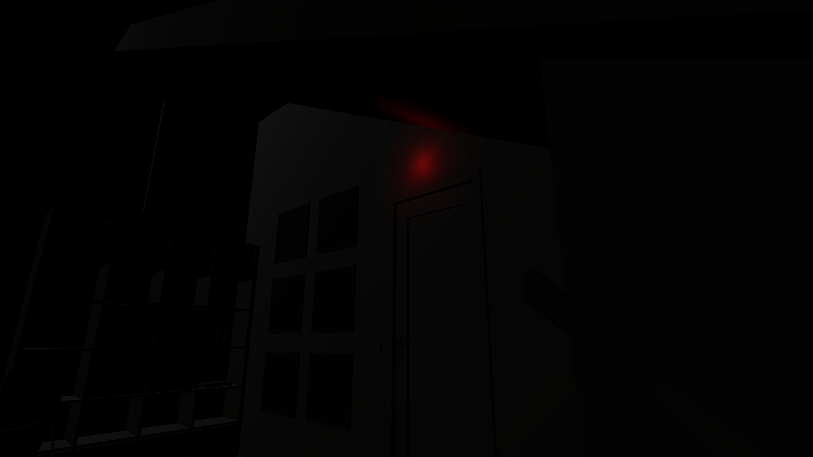

## Portfolio

---

### Unity

<h2>The Path of The Unseen</h2>

The Path Of The Unseen is the project I have been working on these last weeks. 
   This game is about understanding the difficulties some people with mental disorders go through. This is just a demo and in no case represents the reality of them, this just shows some particularities as in a horror game. Hope you enjoy it, I will leave the download link down below.

<iframe frameborder="0" src="https://itch.io/embed/660465" width="552" height="167"><a href="https://marxtodon.itch.io/thepathoftheunseen">The Path Of The Unseen by Marxtodon</a></iframe>
    
 
In game images
 
 
 
 

